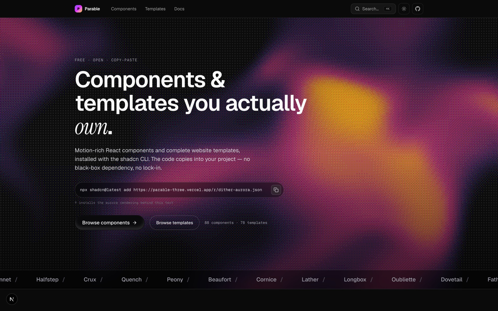
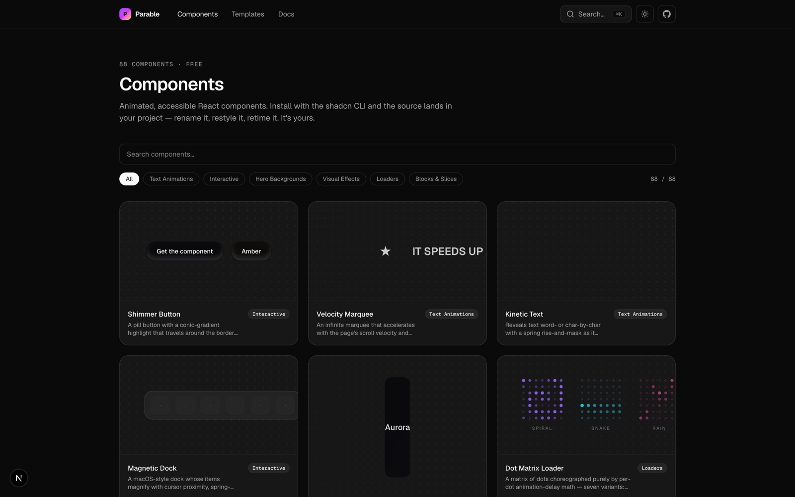
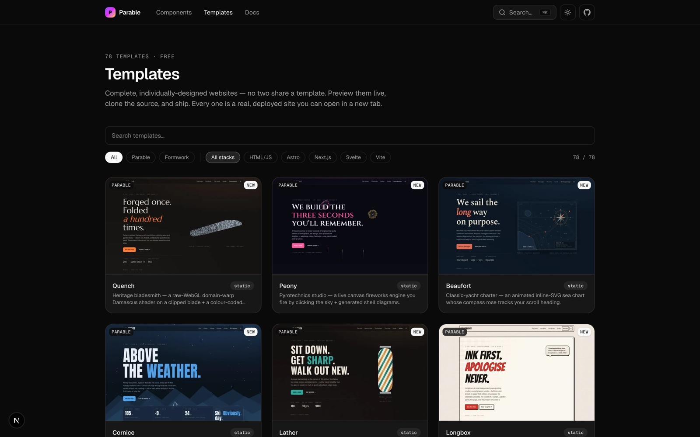

<div align="center">

<h1>Parable</h1>

<p>
  <strong>A free, open marketplace of motion-rich React components and complete website templates.</strong><br>
  Distributed through the <a href="https://ui.shadcn.com">shadcn</a> registry — the code is copied into your
  project, so you own it. No black-box dependency, no lock-in.
</p>

<p>
  <a href="https://parable-three.vercel.app"></a>
  
  
  <a href="LICENSE"></a>
  
</p>

<p>
  <a href="https://parable-three.vercel.app"><b>Live demo</b></a>
  &nbsp;·&nbsp;
  <a href="https://parable-three.vercel.app/components">Components</a>
  &nbsp;·&nbsp;
  <a href="https://parable-three.vercel.app/templates">Templates</a>
  &nbsp;·&nbsp;
  <a href="https://parable-three.vercel.app/docs">Docs</a>
</p>

<a href="https://parable-three.vercel.app">
  
</a>

</div>

<br>

## Why Parable

|  |  |
|---|---|
| **🪶 You own the code** | `shadcn add` writes the source straight into your repo. Rename it, restyle it, retime it — no runtime dependency, no version churn you didn't ask for. |
| **🎬 Motion, done right** | Every component is animated with [Motion](https://motion.dev) and respects `prefers-reduced-motion` out of the box. The wow is in the catalog, not the marketing. |
| **🚀 Real, deployed templates** | 78 complete, individually-designed sites across five stacks — each one a live deployment you preview, clone, and ship. No two share a design. |
| **🤖 MCP-native** | The whole catalog is exposed over Model Context Protocol, so AI agents can browse the registry and install straight from it. |

<br>

## Install a component

Add the `@parable` namespace to your `components.json`:

```json
{ "registries": { "@parable": "https://parable-three.vercel.app/r/{name}.json" } }
```

Then add any component by name — or by full URL, no config needed:

```bash
npx shadcn@latest add @parable/shimmer-button
# or
npx shadcn@latest add https://parable-three.vercel.app/r/shimmer-button.json
```

The source lands in `components/parable/…` and dependencies resolve automatically.
See the [full guide](https://parable-three.vercel.app/docs) to get started.

<br>

## Browse the catalog

<table>
<tr>
<td width="50%">
  <a href="https://parable-three.vercel.app/components"></a>
</td>
<td width="50%">
  <a href="https://parable-three.vercel.app/templates"></a>
</td>
</tr>
<tr>
<td align="center"><b>88 components</b> · six categories<br><a href="https://parable-three.vercel.app/components">Browse components →</a></td>
<td align="center"><b>78 templates</b> · two families, five stacks<br><a href="https://parable-three.vercel.app/templates">Browse templates →</a></td>
</tr>
</table>

Components span **text animations, interactive, hero backgrounds, visual effects, loaders, and blocks & slices** — all copy-paste, all accessible. Templates ship in the **Parable** and **Formwork** families across **HTML/JS, Astro, Next.js, SvelteKit, and Vite**.

<br>

## Clone a template

Templates are complete sites, so they're cloned rather than added:

```bash
npx degit bswxyz/formwork-neon my-site
```

<br>

## Connect over MCP

The catalog is exposed over [Model Context Protocol](https://modelcontextprotocol.io)
at `/api/mcp` — a remote, stateless Streamable-HTTP server with no install and no API key.
Point any MCP-capable client at it to browse and pull components and templates
(`list_components`, `get_component`, `list_templates`, `get_template`).

```bash
curl -X POST https://parable-three.vercel.app/api/mcp \
  -H "Content-Type: application/json" \
  -d '{"jsonrpc":"2.0","id":1,"method":"tools/list"}'
```

Setup for every client is in the [MCP docs](https://parable-three.vercel.app/docs/mcp).

<br>

## Develop

```bash
npm install
npm run dev              # start the dev server → http://localhost:3000
npm run build            # production build
npm run registry:build   # regenerate public/r/*.json from registry.json
```

### Project layout

```
app/                # Next.js App Router — site, MDX docs, OG images, MCP + registry API
components/         # site UI and the component preview harnesses
registry/parable/   # the component source of truth (shadcn registry items)
public/r/           # built registry JSON — what `shadcn add` fetches
public/templates/   # template preview thumbnails
registry.json       # the registry manifest
```

<br>

## Built with

<p>
  
  
  
  
  
  
</p>

<br>

## Contributing

Issues and pull requests are welcome. New components live in `registry/parable/`
and are registered in `registry.json`; run `npm run registry:build` to publish
them to `public/r/`. Please keep every component accessible and reduced-motion-safe.

<br>

## License

Parable is released under the [MIT License](LICENSE) — free and open, every component
and template, no account, no paid tier. Installed components are copied into your project
and are yours to modify and ship.

<br>

<div align="center">
  <sub>Built for people who want to own their front-end. <a href="https://parable-three.vercel.app">parable-three.vercel.app</a></sub>
</div>
